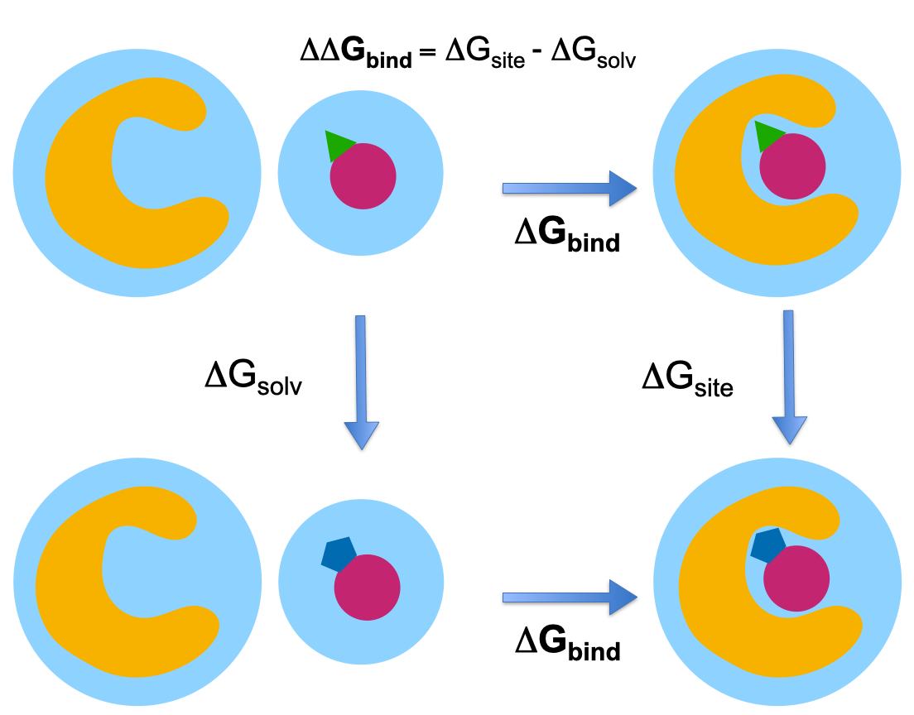

# Setup of Relative Binding Free Energy (RBFE) Calculations with OpenFE

## Why FEP?
**Free Energy Perturbation (FEP)** is a rigorous statistical mechanics approach for computing *relative binding affinities* between ligands.  
It is a cornerstone of modern **structure-based drug discovery**, offering higher accuracy than docking or scoring functions when set up carefully.

**Key advantages**
- Quantifies relative ligand affinities (ΔΔG) with statistical rigor  
- Guides lead optimization in hit-to-lead pipelines  
- Captures subtle effects of force fields, solvation, and conformational changes  

**Setup challenges**
- Accurate ligand mapping and protonation  
- Force field parameterization  
- Construction of the thermodynamic cycle  
- Sampling and free-energy reweighting

## The Thermodynamic Cycle

In **relative binding free energy (RBFE)** calculations (Relative Binding Free Energy) we estimate the difference in binding affinities between two ligands, **A** and **B**, by replacing direct binding/unbinding with *alchemical transformations* that are tractable in simulation.

The notion of **TD cycle** is essential here, since it nicely (and visaully!) connects physical (horizontal) and alchemical (vertical) processes:
 $\Delta \Delta G_\text{bind} = \Delta G_\text{site} - \Delta G_\text{solv}$

  
   
  <em>Different legs of the thermodynamic cycle, showcasing how the $\Delta \Delta G_\text{bind}$ is computed via alchemically transforming one ligand into the other, both in solvent and in complex.</em>

Because free energy is a **state function**, this closed cycle allows us to replace experimental binding processes with simulated alchemical transformations.

---

### Executive Summary
- Demonstrates the **setup stage** of a Free Energy Perturbation workflow using [OpenFE toolkit](https://openfreeenergy.org)  
- This notebook is based on the tutorial materials found online.
- Example application: **TYK2 ligands** benchmark system.  
- Covers protein/ligand prep, atom mapping, thermodynamic cycle, protocol definition, and analysis scaffold.  
- Simulations not run here (HPC required), but workflow shows how $\Delta \Delta G$ would be gathered once results are available.  

---

## What This Notebook Covers
1. **Ligand and protein preparation**  
   - Load ligands from SDF and protein from PDB.  
   - Define `ChemicalSystem`s.  

2. **Atom mapping**  
   - Use **LomapAtomMapper** to define A→B transformations.  
   - Visualize mappings in 2D/3D.  

3. **Thermodynamic cycle**  
   - Set up both **complex** and **solvent** legs for RBFE.  

4. **Protocol definition**  
   - Define λ schedule, equilibration, and simulation settings.  

5. **Transformation & DAG execution scaffold**  
   - Show how transformations can be serialized and run via the CLI (`openfe quickrun`).  

6. **Result gathering (ΔΔG)**  
   - Demonstrate use of `gather()` to combine simulation results (if available).  
   - Show how MBAR is applied for final free energy estimates.  

---

## Limitations
- This notebook focuses on **setup and workflow design**.  
- Simulations were **not run** — they require HPC resources and longer walltimes.

 ## Next steps
  - Running the prepared transformations on an HPC cluster.  
  - Comparing $\Delta \Delta G$ estimates to experimental TYK2 benchmark values.  
  - Exploring multiple atom mapping strategies (Kartograf vs Lomap).  

