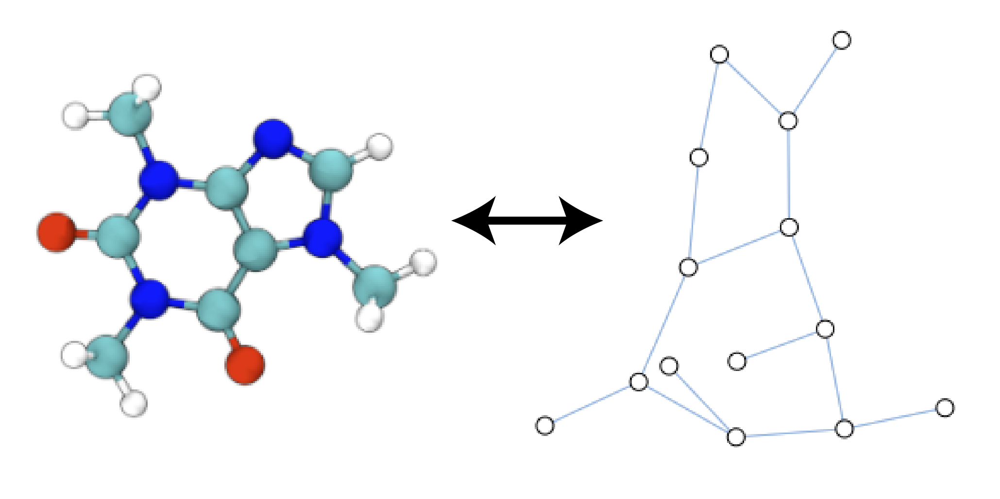
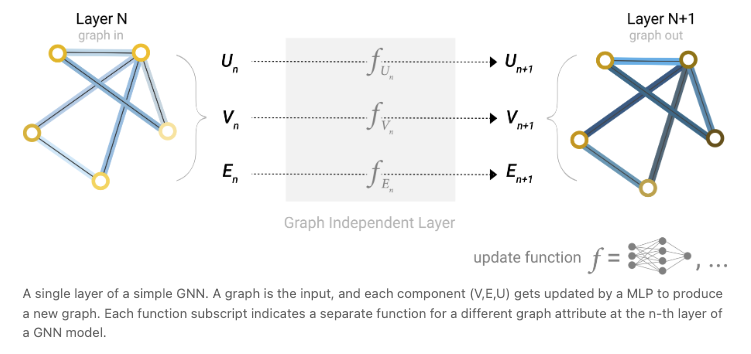

# Graph-level tasks (regression, classification) on molecular databases using Graph Neural Networks

  
   
  <em> Molecules are naturally represented as graphs (left) 3D VMD representation of the caffeine molecule and its heavy atom graph representation (right)(from the following [tutorial](https://distill.pub/2021/gnn-intro/)). </em>

## Overview

- This project applies Graph Neural Networks (GNNs) to molecular property prediction tasks.
- The aim is to revisit toxicity classification and solubility prediction tasks (see `FoundationalML`) using Graph Neural Networks, leveraging the inherent graph-like organization of the input molecules.
- Molecules are featurized/represented as molecular graphs by listing the node indices (and their embeddings) and edge indices (and their embeddings/attributes). By directly leveraging molecular connectivity, GNNs is expected to model chemical and structural relationships more efficiently than architectures like CNNs or MLPs.

## Environment
Notebooks have been run on `Google Colab`, which makes installing `PyG` much easier than on a MacOS. Path to `utils.py` and input_data files have to be edited accordingly.

## Repository Structure
- `Data`: input data file
- `src`: auxiliary functions that are often called in the notebooks
 

## Dataset

- **Tox21**: A dataset of molecules labeled with 12 different toxicological endpoints (e.g., `SR-MMP`, `NR-AR-LBD`, etc.)
- **ESOL**: A dataset of molecules with their log aqueous solubility

## Tools & Libraries

- `RDKit` for converting molecules into molecular graph
- `scikit-learn`, `torch`, `PyG` for model definition, instantiation, training and testing
- `matplotlib`  for visualization
- `joblib` for model persistence
- `src/utils.py`: list of auxiliary functions and classes that are imported in the main notebooks

## Methods

  
   
  <em> A single layer of a simple GNN. A graph is the input (such as a molecule), and each component of the graph gets updated by  a network to produce a new graphs with updated embeddings. Each function subscript indicates a separate function for a different graph attribute at the n-th layer of a GNN model (from the following [tutorial](https://distill.pub/2021/gnn-intro/)). </em>

- Featurization using `RDKit`-based atom and bond features
- `Graph Neural Networks`:
     * Hard-coded using `torch`; simple classification task ("Is there an Oxygen atom in the molecule?") on a user-defined hard coded dataset of a few simple molecules, allowing for node and/or edge message passing,  `Intro_molecules_as_graphs.ipynb`
     * Use standard `PyG` package (task: "Is the molecule toxic with respect to a given endpoint?"), use `early stopping` and `batches`; both `GraphConv` and `NNConv` architectures to control edge-modulated message passing (off vs on),  `GNN_ToxicityClassifier.ipynb`
     * Regression problem ("What is the molecule acqueous solubility?"), just by changing the architecture head from a classifier to a regressor,  `GNN_SolubilityPrediction.ipynb`
- Model evaluation using `R^2`, `RMSE` (regressor) and `ROC AUC` (classifier)

## Learning Highlights

- Implemented graph featurization from SMILES using RDKit
- Learned foundational principles of GNNs (graph representation, message passing, graph-level/node-level tasks)
- Coded a GNN from scratch in `torch`; including edge-passing logic
- Learned `PyG` syntax and practiced when it comes to preparing the data for training and testing (`Data`, `DataLoader`, `Batch`)
- Used `PyG`-based `GraphConv` and `NNConv` and `global_mean` to define legit GNN architectures for classification and regression; allowed both for edge modulated passing and node only passing
- Modularized code for readability and reuse (`utils.py`)

## Proposed Expansions

- [TO DO] Understand how **node-dependent prediction tasks** are performed/implemented in `PyG` (e.g., atom classification, aromaticity)
- [TO DO] Visualization of learned embeddings

